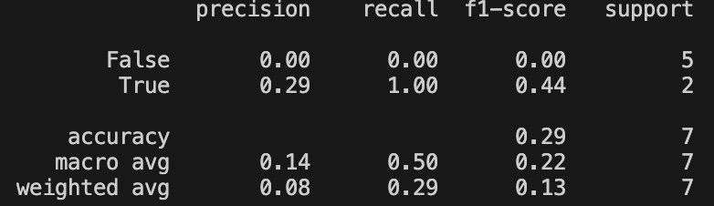

# Decision tree and svm classification

Authors: Antoni Kania, Rafał Sojecki

Application solve problem of making recommendations based on previously rated movies by different users. It uses clustering algorithm (k-means) with different, user selected metric to achieve this goal

## Usage

1. Install the dependencies listed in the `requirements.txt` file (in root folder of repository):
    ```bash
    pip install -r requirements.txt
    ```
2. Run application
   ```bash
    python index.py
    ```
    [Non-default kernel](####User-selectable-kernel-for-svn)
Application will run all functionality described in [features](Features) for each dataset in order.

## Features

#### 3 datasets
##### Job satisfaction survey
Survey made by ourselves - 31 people answered question on their job satisfaction, age, education level. Csv file with result prepared to make easy implementation in code [data](resources/job-satisfaction-survey.csv)

EducationLevel legend:
1 Elementary school graduate
2 Junior high school graduate
3 High school graduate
4 Bachelor
5 Master
6 Doctorate

Classification if person is satisfied with their job

Due to small amount of surveyed people - accuracy level of predictions is low (~40%)

##### Pima indians diabetes
Dataset fetched from https://machinelearningmastery.com/standard-machine-learning-datasets/

Classification if person has diabetes

##### Titanic passengers list
Dataset fetched from https://github.com/datasciencedojo/datasets/blob/master/titanic.csv

Classification if person survives the accident

#### Visualisation of the decision tree and svn.


#### Data quality metrics
Printed on standard output (linear kernel)
```
Decision Tree Accuracy: 0.42857142857142855
              precision    recall  f1-score   support

       False       0.60      0.60      0.60         5
        True       0.00      0.00      0.00         2

    accuracy                           0.43         7
   macro avg       0.30      0.30      0.30         7
weighted avg       0.43      0.43      0.43         7

No metric provided, linear
SVM Accuracy: 0.42857142857142855
              precision    recall  f1-score   support

       False       0.67      0.40      0.50         5
        True       0.25      0.50      0.33         2

    accuracy                           0.43         7
   macro avg       0.46      0.45      0.42         7
weighted avg       0.55      0.43      0.45         7
```

#### Classifiers invocations with example data
Printed on standard output
```
Decision tree prediction for person1: Isn't happy
Decision tree prediction for person2: Is happy
SVC prediction for person1: Isn't happy
SVC prediction for person2: Is happy
```
#### User selectable kernel for svn 
When you run application

```bash
python index.py <kernel_name>
```

instead of <kernel_name> you can put kernel that you want to use, or leave empty (in that case it will use linear kernel. Avaliable choices are : 'linear', 'poly', 'rbf', 'sigmoid' and 'precomputed'
##### Example usage 
(for survey)
| kernel         | accuracy  | visualization | Metrics data |
| ---------- | ---------- | --------- | --------- | 
| linear     | 0.43    | | |
| sigmoid     | 0.29    | | |
| poly  | 0.29  | | |
| rbf | 0.29 |  | |
| precomputed | cannot use - needed square matrix |