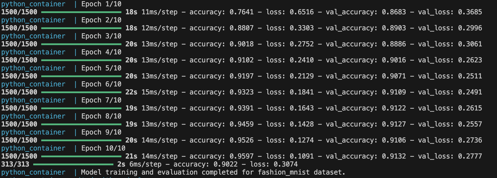
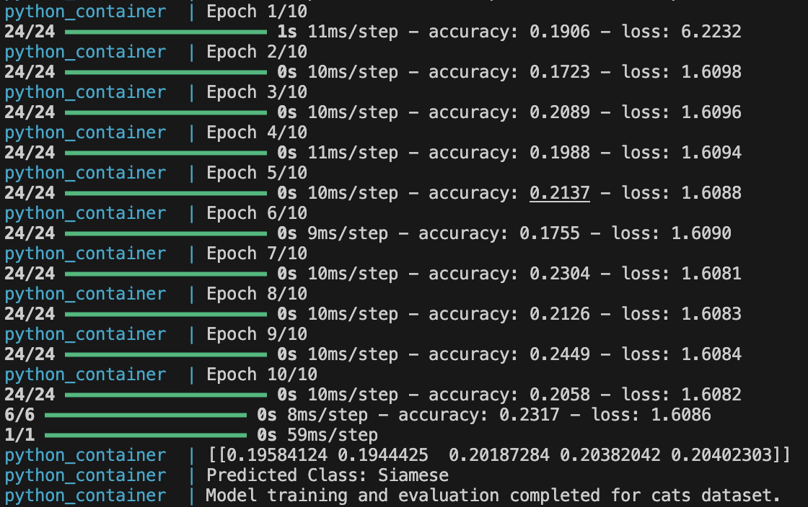
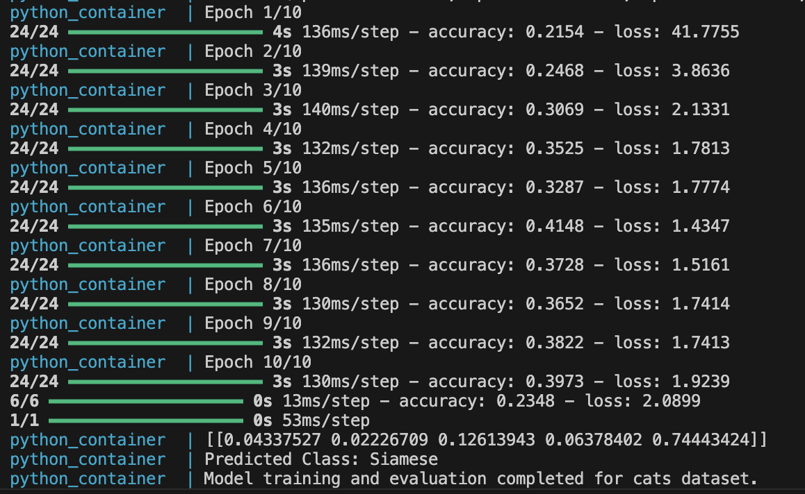
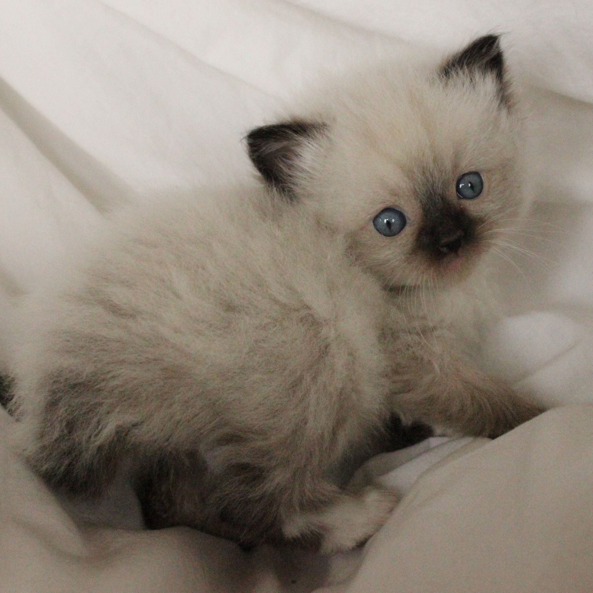
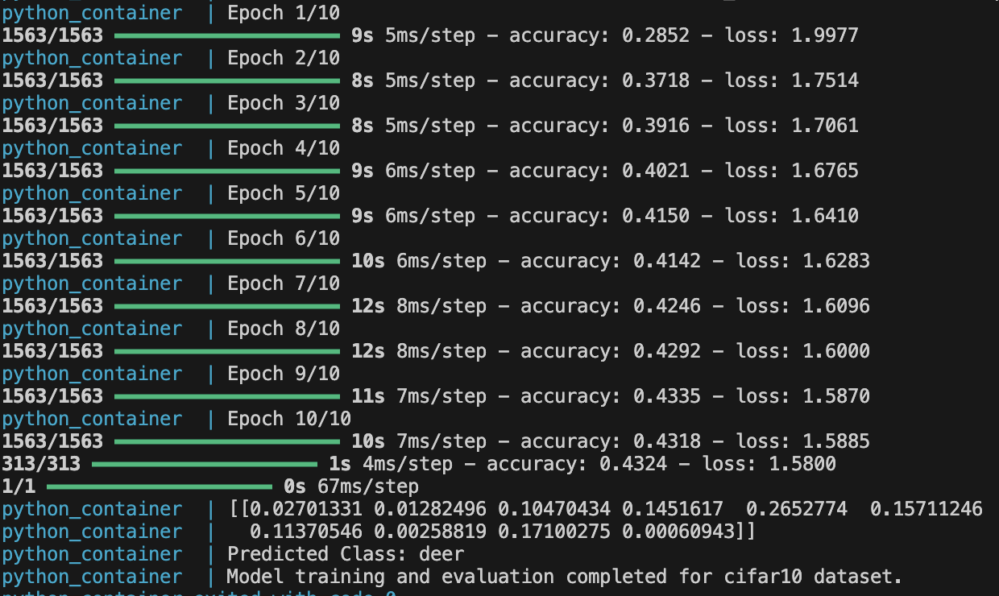
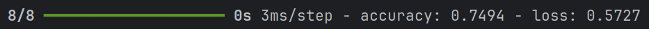
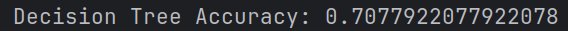
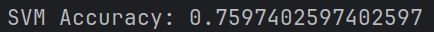

# Neural networks

Authors: Antoni Kania, Rafał Sojecki

The application provides an implementation of neural networks for solving classification problems.

## Usage

1. Install the dependencies listed in the `requirements.txt` file (in root folder of repository):
    ```bash
    pip install -r requirements.txt
    ```
2. Run application
   ```bash
    python index.py <model_name>
    ```

Application will run all functionality described in [models](Models) for each dataset in order.

## Models

### fashion_mnist

### cats

On this network we compared ussage of 2 sizes of neural networks (by neuron count). [Used dataset](https://www.kaggle.com/datasets/yapwh1208/cats-breed-dataset/data)

#### 16 neurons



#### 256 neurons



Bigger neural networks have better accuracy than smaller ones, but the learning process takes longer. In both cases, the network correctly classified this cat.

 
### cifar10
 Trained network, To test it we used first image of dataset to classify it.
 
### pima

#### Accuracy comparison with decision tree and SVM for pima dataset
- Neural Network Accuracy: 0.7494
- Decision Tree Accuracy: 0.7077
- SVM Accuracy: 0.7597







