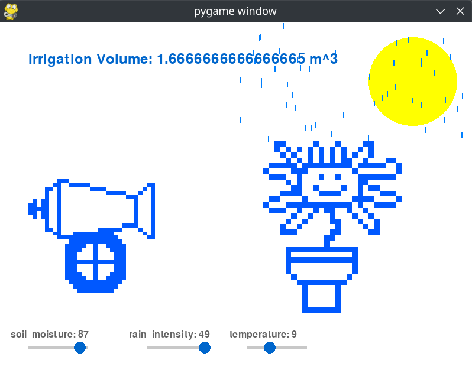
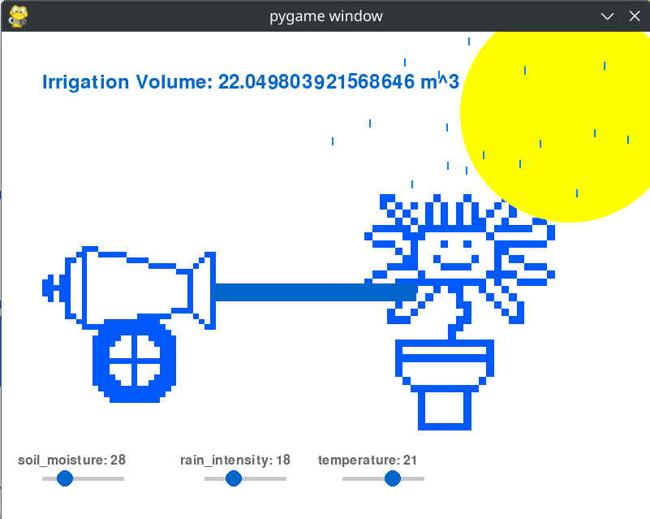
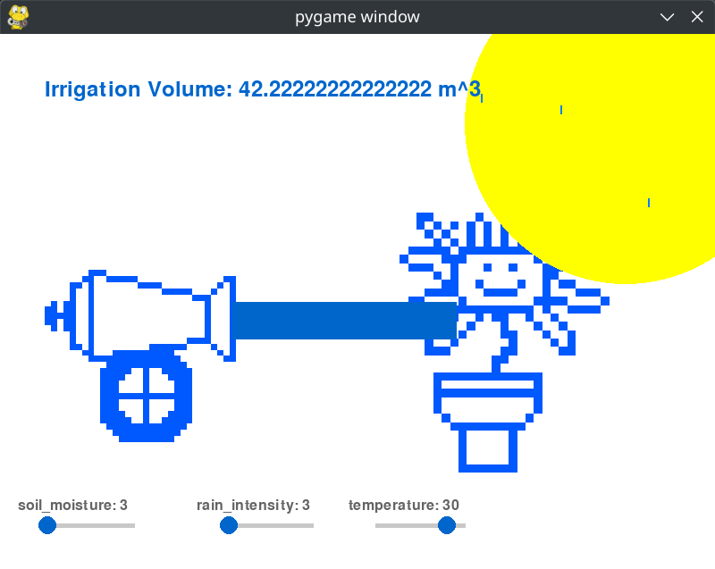
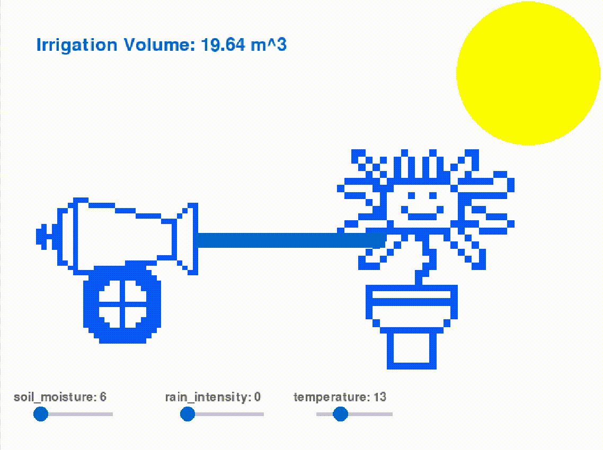

# Automatic Irrigation System Simulation with Fuzzy Logic
This project demonstrates a simulated automatic irrigation system using fuzzy logic in Python, designed to optimize water usage based on environmental conditions. Fuzzy logic provides a flexible approach to decision-making, allowing the system to adapt irrigation levels according to real-time changes in soil moisture, temperature, and rain intensity.

## Features
- Fuzzy Logic-Based Decision-Making: The system uses a fuzzy logic controller to calculate irrigation volume based on the input values of soil moisture, rain intensity, and temperature. This approach enables smooth transitions in irrigation levels, creating a more adaptive response compared to traditional control systems.

- Real-Time Simulation with Adjustable Parameters: A set of interactive sliders (or knobs) allows you to adjust soil moisture, rain intensity, and temperature in real time. The system responds instantly, showing the effects on irrigation volume. This interactive component provides hands-on experience in observing how different environmental conditions impact water usage.

- Dynamic Visual Feedback: The simulation includes graphical elements to represent sunlight, rain, and water flow, which change dynamically in response to the input conditions. For example:

    - Sunlight varies based on temperature, influencing evaporation rates.
    - Raindrops appear with changes in rain intensity, which can reduce irrigation demand.
    - Water Flow adjusts according to the calculated irrigation volume, helping to visualize the system's response.

## Screenshots

# Video
